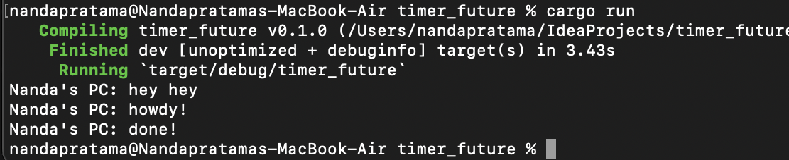

### Tutorial 10

**1.2. Understanding how it works.** 

From the screenshot above, we can see that the async function
will be executed outside the main thread. The println!("Nanda's PC: hey hey"); statement in the main function is executed immediately after the async block is spawned. It does not wait for the async block to finish, 
hence "hey hey" can be printed before "howdy!" and "done!". 

**1.3. Multiple Spawn and removing drop** 

From the screenshot above, we can see that the existence of many spawners will affect more tasks to be executed because many tasks will be queued into the task sender. 
If we remove the drop statement, the program will not be able to finish because the task sender assumes that there are still tasks that need to be executed.
Therefore, it's crucial to call drop on the spawner when we're done spawning tasks to signal to the executor that it can finish once all the currently queued tasks are executed.
